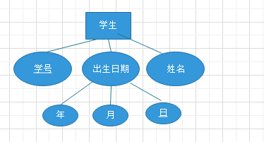
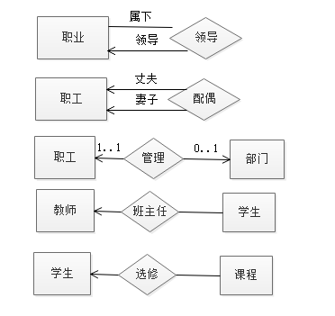

#数据库设计
##数据库设计的一般定义
- 数据库设计是指对于一个给定的应用环境，构造优化的数据库的逻辑模式和物理结构，并根据此建立数据库以及应用系统，使之能够有效地存储和管理数据，满足各种用户的应用需求，包括信息管理需求和数据操作需求。
- 分析：这句话的逻辑结构分析：通过什么手段，达到什么目的

##数据库设计的过程
###需求分析
   - 需求分析的任务是通过详细调查现实世界需要处理的对象，充分了解原系统（手工系统或计算机系统）的工作概况，明确用户的各种需求，然后在此基础上确立新系统的功能，新系统必须考虑今后的可能的扩充和改变，不能仅仅当前需求来设计数据库。
   - 数据字典是进行需求分析的主要成果，它是关于数据库中数据的描述，即元数据，而不是数据本身。数据字典是需求分析阶段监理，在数据库设计过程中不断修改，充实，完善的，他在数据库设计中占有很重要的地位。
   - 数据字典通常包括数据项、数据结构，数据流，数据存储和处理过程几部分。
   
### 概念结构设计（概念模式，ER图）
   - 将需求分析的到的用户需求抽象为信息结构的过程就是概念结构设计，它是整个数据库设计的观念。
   - 主要成果是ER图，主要解决的问题：消除冲突
     -  属性冲突
          - 属性域的冲突:属性的类型、取值范围不同 如不同学校的学号编码方式不同，
          - 属性取值单位冲突,如重量分别采用磅、千克
     - 结构冲突   
          - 同一对象在不同应用中的抽象不同,如职工在某应用中是实体，在另一应用中则抽象为属性
          - 同一实体在不同E-R图中属性组成不同  
          - 实体之间的联系在不同E-R图中呈现不同的类型
     - 命名冲突   
         - 同名异义:不同意义的对象具有相同的名字 
         - 异名同义:同一意义的对象具有不同的名字

###逻辑结构设计（逻辑模型，全局模式、用户模式）
  - 概念结构独立于任何一种数据模型的信息结构。逻辑结构设计的任务就是把概念设计阶段设计好的基本ER图转换为与选用的数据库管理系统产品所支持的逻辑结构。
  - 如表结构、树、网 ，并进行规范化处理，选择合适的DBMS，设计外模式。
  
###物理结构设计（物理模型）
  - 为一个给定的逻辑数据模型选择一个最适合应用要求的物理结构的过程，就是数据库的物理设计。
  - 通常关系数据库物理设计的内容主要包括为关系模式选择存取方法、以及设计关系、索引等数据库文件的物理存储结构。
 
###数据库实施
  - 数据库实施阶段包括两项重要的工作，一项是数据的载入，另一项是应用程序的编码和调试。
 
###数据库运行与维护
  - 系统的运行与数据库的日常维护。

##ER图转换
   - E-R图的实体转换为关系
   - E-R图的属性转换为关系的属性
   - E-R图的关键字转换为关系的关键字  
   
###基本转换规则:复合属性的转换
 - 将每个分量属性作为复合属性所在实体的属性 
 - 或者，将复合属性本身作为所在实体的属性
   
   
   
    如图所示 ： 我们可以将关系图转换为. 
     
    -  出生日期(学号，年，月，日） 学生信息（学号，姓名）
    - 学生（学号，姓名，年，月，日）
   
###多值属性的转换：将多值属性与所在实体的关键字一起组成一个新的关系
   
   
   - 学生（学号，姓名）
   - 选课（学号，所选的课程）
   
###基本转换规则：联系的转换
 -  一对一的联系
   -  如果联系双方均是部分参与（0..1），则将联系定义为一个新的关系，属性为参与双方的关键性属性。
     - 职工（职工号,...）, 配偶（丈夫职工号，妻子职工号）
  部分参与联系：因为男的女的可能都是单身，所以是部分参与联系。
     -  如果联系的一方全部参与（1..1）,则将联系另一方的关键字作为全部参与一方关系的属性。
     - 职工（职工号,...）
     - 部门（部门号，部门名，职工号）
     - 为什么是部分参与联系
 - 一对多的关系：将单方参与实体的关键字作为多方参与实体的对应关系的属性
       -  教师（教工号，。。。）
       - 学生（学生号，名字，班主任教工号）
       
       - 领导来源于职工，一个员工领导多个员工
       职工（职工号，职工名，部门号，领导职工号）
 - 多对多的联系 ：将联系定义为新的关系，属性为参与双方实体的关键字
   - 学生（学号，...）, 课程（课号，...）, 选修（学号，课号，成绩）
   
   
###基本转换规则：弱实体的转换
- 所对应关系的关键字由弱实体本身的区分属性再加上所依赖的强实体的关键字组成
- 产品名是个弱实体，依赖于公司。 产品（产品名，价格，公司名）  

###基本转换规则：泛化与具体话实例的转化
- 高层实体（泛化实体）和底层实体（具体化实体）分别转化成为不同的关系
   - 低层实体所对应的关系包括高层实体的关键字 
   - 如果泛化实体实例是具体话实例的全部，即高层的实体实例至少属于一个低层实体，则可以不为
    高层实体建立关系，底层实体所对应的关系包括上层实体的所有属性。

###基本转化规则：多元联系的转换
  - 多元联系可以通过继承参与联系的各个实体的关键字而形成新的关系  
  - 这些继承过来的关键字可作为新关系的关键字  
  - 也可以新增一个区分属性作为关键字
