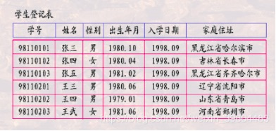

#数据库系统的结构抽象与演变

##基本概念
要了解数据库系统的标准结构，必须清楚以下概念。

- 模式（Schema）：对数据库中的数据所进行的一种结构性的描述（也就是所观察到的结构性信息 就是表的数据结构）
- 视图（view）/数据：某一表现形式下表现出来的数据库中的数据。
 - 如：学生登记表( 学号char(8), 姓名char(10),性别Char(2), 出生年月datetime, 入学日期Datetime, 家庭住址Char(40) )；这是数据的结构 --模式。  
 - 如：下图所展现的数据就是视图

.  
  
##三级模式-两层映像

###三级模式：

- External Level = User Level（外模式或者叫做子模式或者叫做用户模式）：某一用户能够看到与处理的数据, 全局数据中的某一部分。
  - 外模式也称为子模式或者用户模式，它是数据库用户（包括应用程序猿鹤最终用户）能够看见和使用的局部数据的逻辑结构和特征的描述，是数据库用户的数据视图，是与某一应用相关的数据的逻辑表示。
  
  - 外模式通常是模式的子集。一个数据库可以有多个外模式。由于它是各个用户的数据视图，如果不同的用户在应用需求，看待数据的方式，对待数据的保密要求等方面的差异，其外模式的描述就是不同的。即使对模式中的同一数据，在外模式中的结构，类型、长度、保密级别都可以不同。另外一方面，同一外模式也可以为多个应用系统所使用，但是一个应用程序只能有一个外模式。
  
  - 外模式是保证数据库的安全性的有力措施，每个用户只能看到和访问对应的外模式中的数据，数据库中的其余数据是看不到的。
  
- Conceptual Level = Logic level（概念模式或者叫做逻辑模式或者叫做模式）：从全局角度理解/管理的数据, 含相应的关联约束

 - 模式也称之为逻辑模式，是数据库中全体数据的逻辑结构和特征的表示，是所有用户的公共视图。它是数据库系统模式结构的中间层，既不涉及数据的物理存储细节，又与具体的应用程序、所使用的开发工程和高级程序设计语言无关。
 
 - 模式实际上是数据库数据在逻辑上的视图，一个数据库只有一个模式，数据库模式以某一种数据模型为基础，统一综合了各个用户的需求，并将这些需求有机的结合成为一个逻辑整体，定义模式的时候不仅仅要定义数据的逻辑结构，例如数据记录由哪些数据结构组成，数据项的名字，类型，取值范围等；而且要定义与数据有关的安全性和完整性要求。
 
- Internal Level = Physical level（内模式或者叫做储存模式或者叫做物理模式）存储在介质上的数据，含存储路径、存储方式、索引方式等。
	-  内模式也称为存储模式，一个数据库只有一个内模式，它是数据物理结构和存储方式的描述，是数据在数据库内部的组织方式。 
三者关系如下图所示：

.  
  

##两层映像：

- 映像：就是指的是从一种结构映射到另外一种结构

- E-C Mapping(EC映射) 指的是外模式到概念模式映射。（当概念模式改变的时候，只需要改变EC映射，而不需要改变应用程序 这样便于用户的观察与使用）

- C-I Mapping(CI映射)指的是概念模式到内模式的映射（当内模式改变的时候，只需要改变CI映射。便于计算机的存储及其实现而不用改变概念模式）

注：应用程序的开发是基于外模式，因而要保持外模式不变。

两层映像涉及到了上面提到的所谓变与不变：

  - 逻辑数据独立性：模式保持子模式不变（只改变EC映射）

  - 物理数据独立性：物理模式改变模式不变（只改变CI映射）

